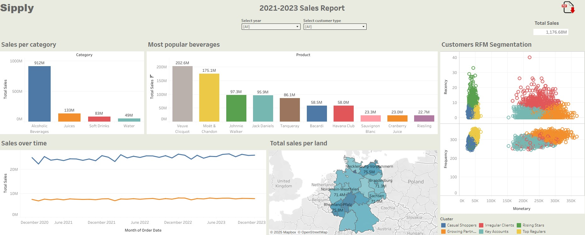
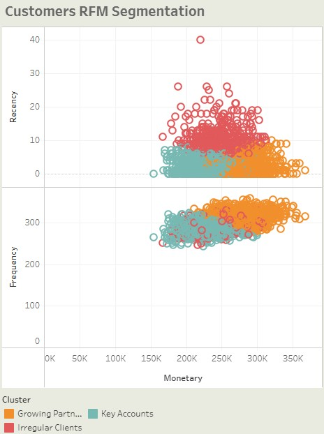
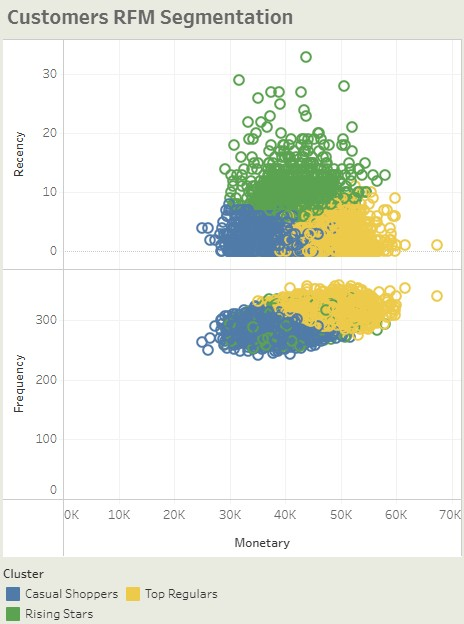

# Beverage Sales Analysis (2021-2023)
The report below summarizes sales data of a certain German company (called **Sipply** for the purpose of this analysis) specializing in selling beverages. 
The dataset (downloaded from [Kaggle](https://www.kaggle.com/datasets/sebastianwillmann/beverage-sales/data)) is synthetic yet designed to simulate realistic patterns in the beverage industry.
All of the information below refer to the [interactive Tableau dashboard](https://public.tableau.com/app/profile/micha.kilarski5715/viz/BeverageSalesDashboard_17447325903020/Dashboard1).

## Key Metrics and Dimensions
- **Sales**: total sales of all beverages (in euros)
- **Customer Type**: B2B or B2C
- **Recency**: number of days since the last purchase (used in RFM analysis)
- **Frequency**: number of orders in the given time period (used in RFM analysis)
- **Monetary**: monetary value of orders (used in RFM analysis)

## Insights
- Regardless the customer type, alcoholic beverages are the key to Sipply's business, accounting for over 77% of total sales.
- The 10 most popular brands are similar between B2B and B2C customers, however B2B's most purchased brand is Moët & Chandon while that of B2C customers is Veuve Clicquot.
- Sales do not display seasonality (except for shorter February), whereas B2B sales show slightly higher variability and overall small but steady growth
- Overall, most income comes from the lands of Hamburg, Saarland, and Hessen. This is also true for, and skewed by, B2B customers. On the other hand, B2C sales are driven mostly by the lands of Niedersachsen, Hamburg, and Sachsen.

### Customer segmentation
Based on RFM analysis with k-means, 3 segments of customers were defined for both B2B and B2C customer groups.

**B2B**:
- **Key Accounts**: long-term clients (incl. bars, hotels, distributors) who buy often and in large volumes
- **Growing Partners**: new or small business clients with potential to grow
- **Irregular Clients**: businesses that used to buy often but have gone quiet

**B2C**:
- **Top Regulars**: high-spending individuals, likely enthusiasts or influencers in the alcohol niche
- **Rising Stars**: first-time buyers or low-frequency casual customers
- **Casual Shoppers**: once-loyal customers who have not bought in a while

## Recommendations and Next Steps
1. Approaches to customer segments:
   - **Key Accounts (B2B)**: offer contract-based pricing or custom packages, invite to partner-only tastings or launch events, provide a dedicated account manager, reward loyalty with co-branded promotions or early product access
   - **Growing Partners (B2B)**: onboard with starter kits, business bundles, or sample sets, provide a B2B catalog and volume incentive after first few orders, offer guidance via account management or industry tips, set up automated follow-ups for reorder prompts
   - **Irregular Clients (B2B)**: run “We Miss You” offers or personalized win-back campaigns, reach out directly to understand needs (survey, call), share new product lines, delivery upgrades, or flexible terms, offer contract renewal bonuses or rebates
   - **Top Regulars (B2C)**: create a VIP club with perks (free shipping, samples, invites), offer limited editions, premium bundles, and early access, personalized emails with tasting notes, drink pairings, or curated boxes, build community through exclusive virtual tastings
   - **Rising Stars (B2C)**: send educational content (e.g., "How to enjoy craft spirits"), promote value packs, first-time buyer discounts, encourage reviews or referrals with incentives, use social proof (top-rated products, user reviews)
   - **Casual Shoppers (B2C)**: use emotional reactivation (“Your favorite flavors miss you!”), offer time-limited discounts or “Welcome Back” bundles, highlight what’s new since they last purchased, test retargeting ads and seasonal promotions
2. **Boost B2C engagement and loyalty** through:
   - Targeted promotions for premium alcoholic beverages (Veuve Clicquot, Moët & Chandon)
   - Loyalty programs or seasonal offers in strong B2C lands like Sachsen or Niedersachsen
3. **Focus B2C communication strategy on experience, quality, and branding** rather than volume (which is driven by B2B segment)
4. **Strengthen presence in key regions** through:
   - Geotargeted marketing in strong B2C regions
   - Localized campaigns with retail partners or delivery platforms to increase regional penetration
5. **Capitalize on champagne affinity in B2C**:
   - Introduce gift packs, celebratory campaigns, or exclusive editions of premium champagne brands, especially around festive seasons
   - Drive interest by cooperation with lifestyle influencers or online tasting experiences
6. **Upsell and cross-sell to existing B2B clients**: use Moët or Veuve purchases as entry points to upsell on Jack Daniels or mixers (soft drinks)
7. Introduce **premium package bundles for events and hospitality**: leverage the popularity of high-end alcoholic beverages to build:
   - *Event bundles* (e.g. wedding/event boxes with Moët, Veuve, Tanqueray)
   - *Corporate gifting packages* (especially during Q4/holidays)
   - *Bar/restaurant starter packs* (including Bacardi, Havana Club, mixers, branded barware)
